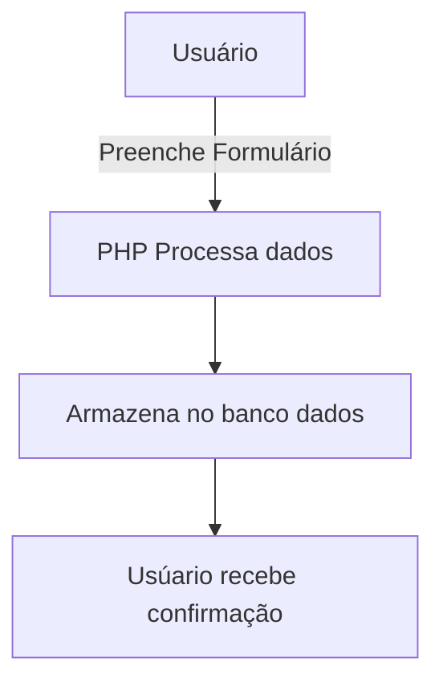

# Projeto: Cadastro de clientes

## Estrutura do projeto

```mermaid 

graph TD;
   A[Usuário] -->|Preenche Formulário| B[PHP Processa dados];
   B --> C[Armazena no banco dados];
   C --> D[Usúario recebe confirmação];


```

